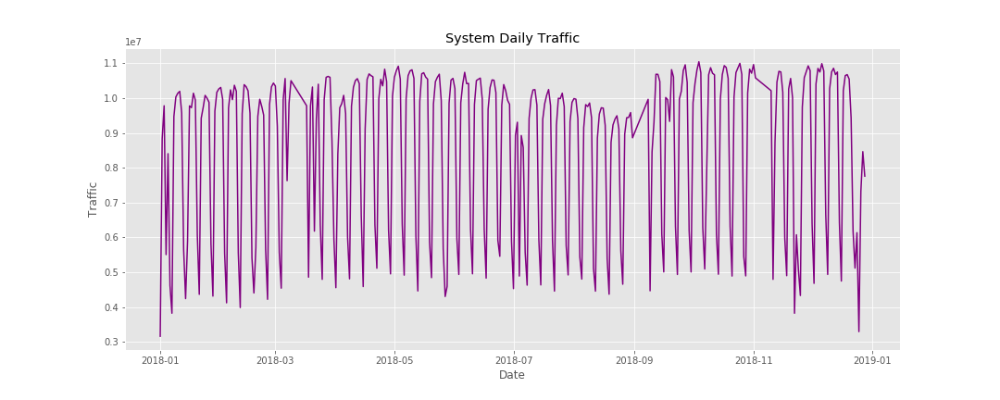
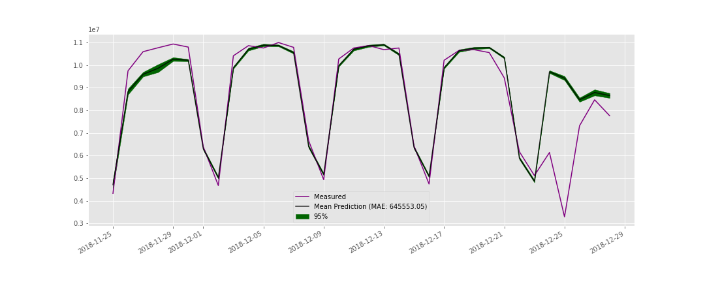

# Exploring time series forecasting using NYCT subway data
Using MTA turnstile data, I explore some basic time series forecasting and discuss the results

* Daily passenger traffic across the entire subway

* Result of RNN on the subway data

## Future work
* Explore multivariate time series models by incorporating weather data
* Look at correlations in the data to better performance of ML algorithms
* Take advantage of the periodicty and forecast using the Fourier Transform
